<h1 align="center">greps.net</h1>

<strong>Find unregistered domains — across every TLD, at scale.</strong>

Check a single name across 35 TLDs instantly, or sweep thousands of candidates at once
against the official IANA RDAP registry. Pay-as-you-go, no subscription.

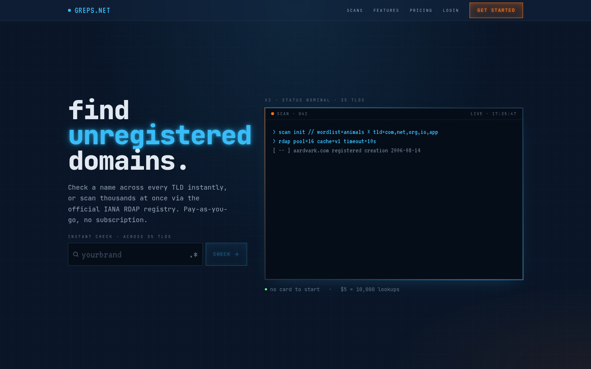

> **This is a public showcase of the project.** It's here to show what greps.net does — the
> application source itself is private.

---

## What it is

greps.net is a domain-availability scanner built for people who buy and brand domains.
Instead of checking names one at a time, you point it at a wordlist and it verifies
availability across your chosen TLDs using **RDAP** — the registries' own authoritative
protocol, not scraped WHOIS or guesswork — then scores and prices every hit so the good
ones rise to the top.

## Features

- **Instant check** — one name across 35 TLDs in a keystroke.
- **Bulk scans, eight ways** — see below.
- **39 built-in wordlists** — Nouns, Verbs, Adjectives, Animals, Colors, Gemstones,
  Astronomy, Brand Morphemes and more — plus upload your own.
- **Authoritative availability** — every check goes to the official IANA RDAP registry, so
  "available" actually means available.
- **Scored & valued** — each result gets a brandability score and an estimated resale value.
- **Manage the pipeline** — filter, search, sort and export (CSV / JSON); re-check any
  result via RDAP; star favorites; keep a watchlist that emails you the moment a taken
  domain frees up; and track buys and sells in a portfolio.
- **Pay-as-you-go** — $5 = 10,000 lookups. No subscription, no card to start.

## The scanner

Pick a strategy, point it at a wordlist, choose your target TLDs, and see a live credit
estimate before you commit.

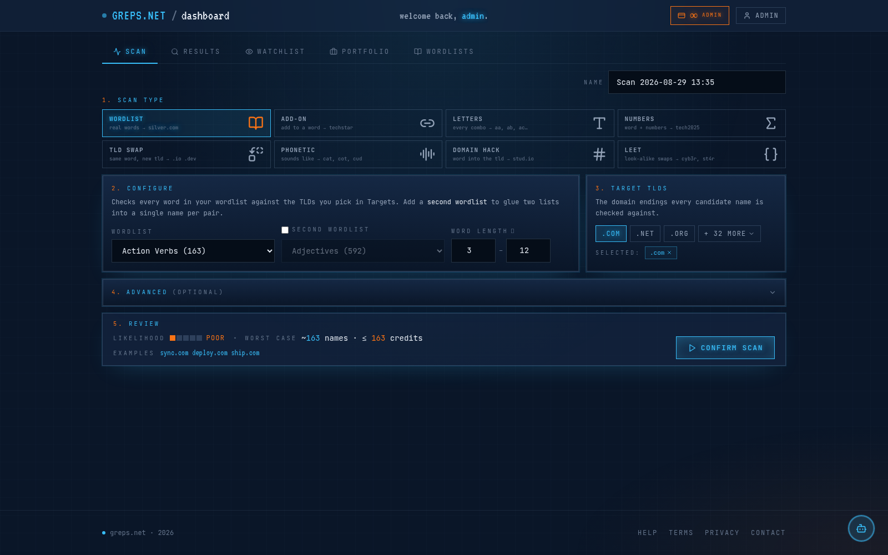

### Watch it run

Launch a scan and every candidate streams past in real time — a fast DNS pre-check, then an
authoritative RDAP lookup — alongside live progress, a running hit count, and credits spent.

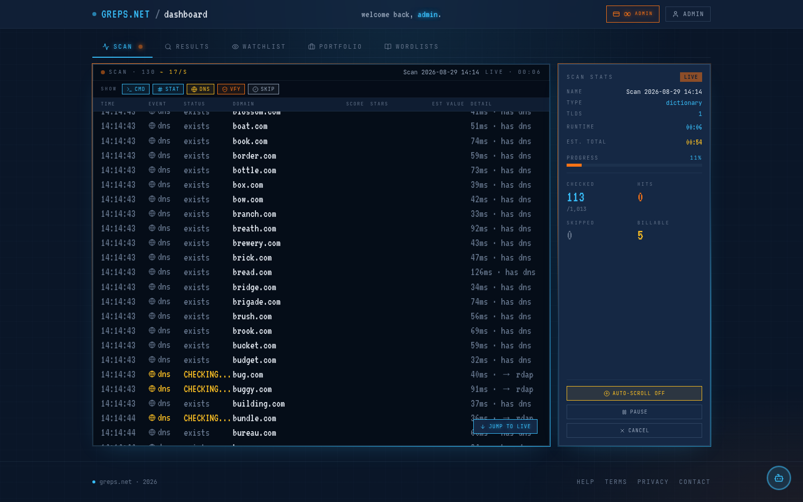

### Eight ways to generate names

<table>
<tr>
<td width="50%" align="center">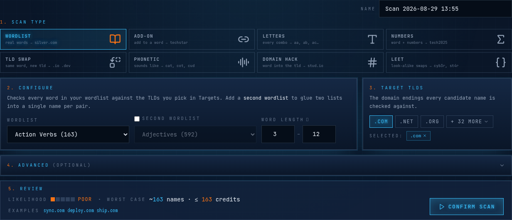 <strong>Wordlist</strong> — real words from a list; glue two lists for <code>word + word</code> brandables.</td>
<td width="50%" align="center">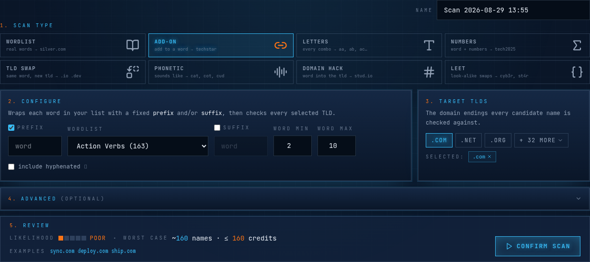 <strong>Add-on</strong> — wrap every word with a fixed prefix and/or suffix.</td>
</tr>
<tr>
<td width="50%" align="center">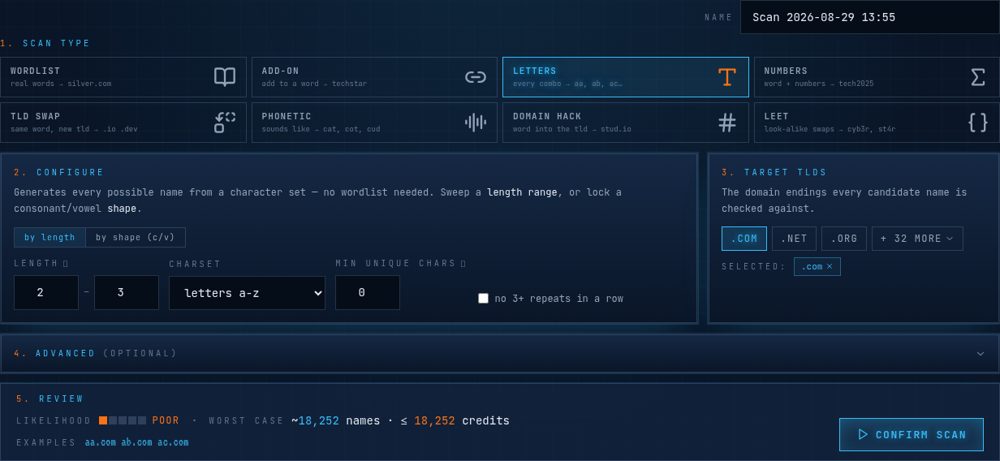 <strong>Letters</strong> — every possible combination from a character set, no wordlist needed.</td>
<td width="50%" align="center">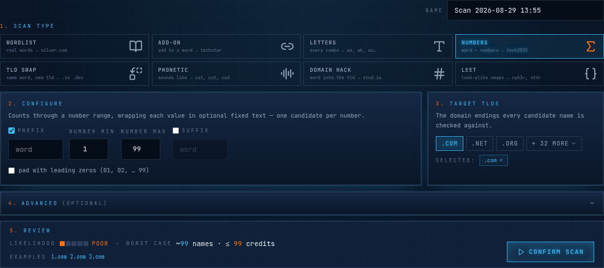 <strong>Numbers</strong> — count through a range, wrapped in optional fixed text.</td>
</tr>
<tr>
<td width="50%" align="center">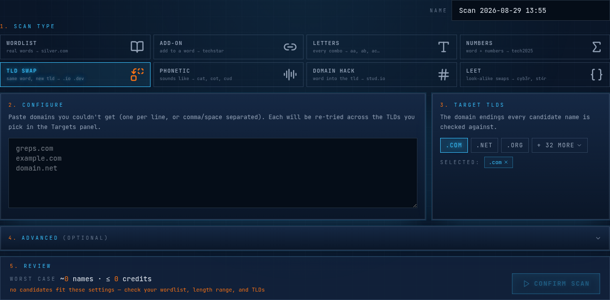 <strong>TLD Swap</strong> — re-try names you couldn't get across a new set of TLDs.</td>
<td width="50%" align="center">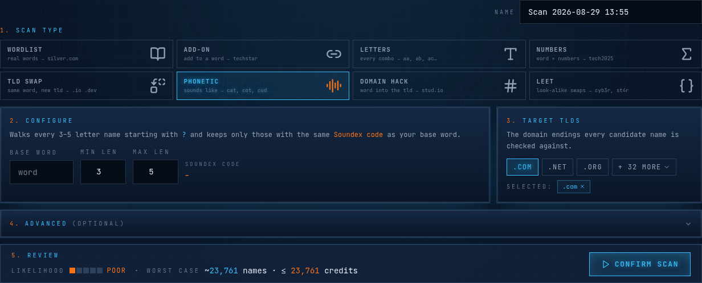 <strong>Phonetic</strong> — names that <em>sound like</em> your base word (Soundex).</td>
</tr>
<tr>
<td width="50%" align="center">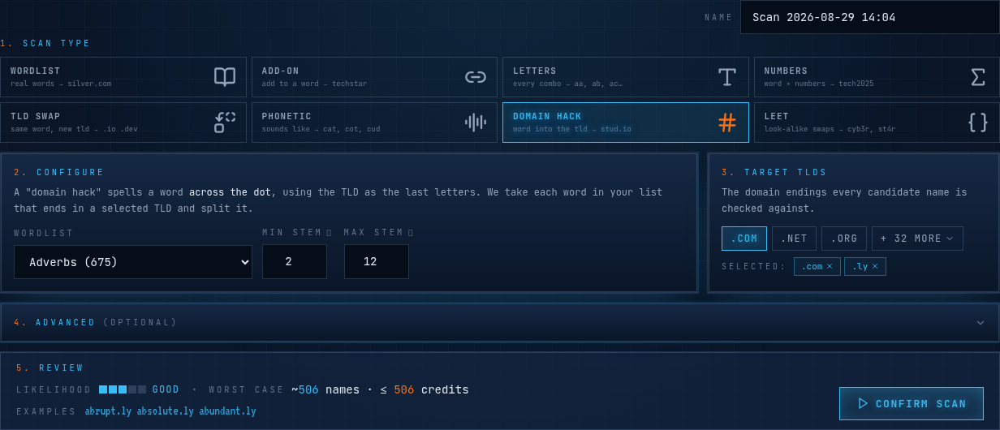 <strong>Domain Hack</strong> — spell a word across the dot, using the TLD as the last letters (<code>stud.io</code>).</td>
<td width="50%" align="center">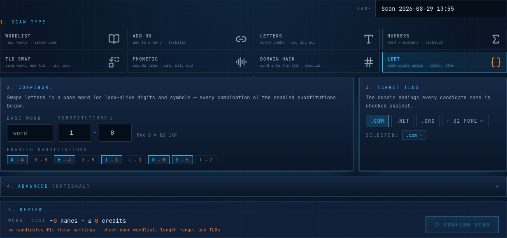 <strong>Leet</strong> — look-alike digit and symbol swaps (<code>cyb3r</code>, <code>st4r</code>).</td>
</tr>
</table>

### 35 TLDs, one picker

Three quick chips for the common endings, and a searchable popover for the full set —
from `.com` and `.io` to `.ai`, `.dev`, `.studio` and more.

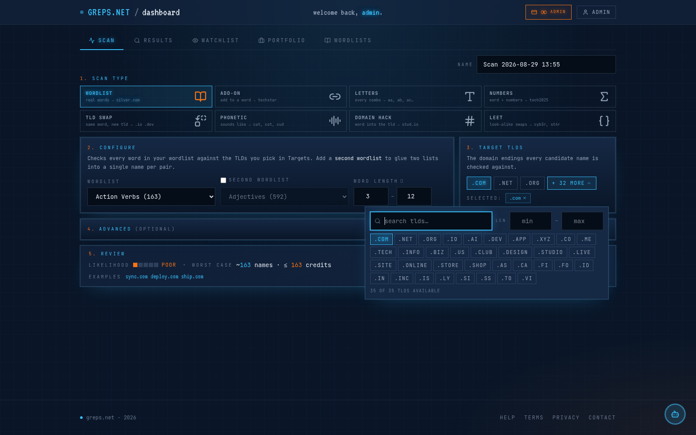

## Working the results

Every candidate, scored and priced — filter by length, TLD, score or scan, then export or
re-check in bulk.

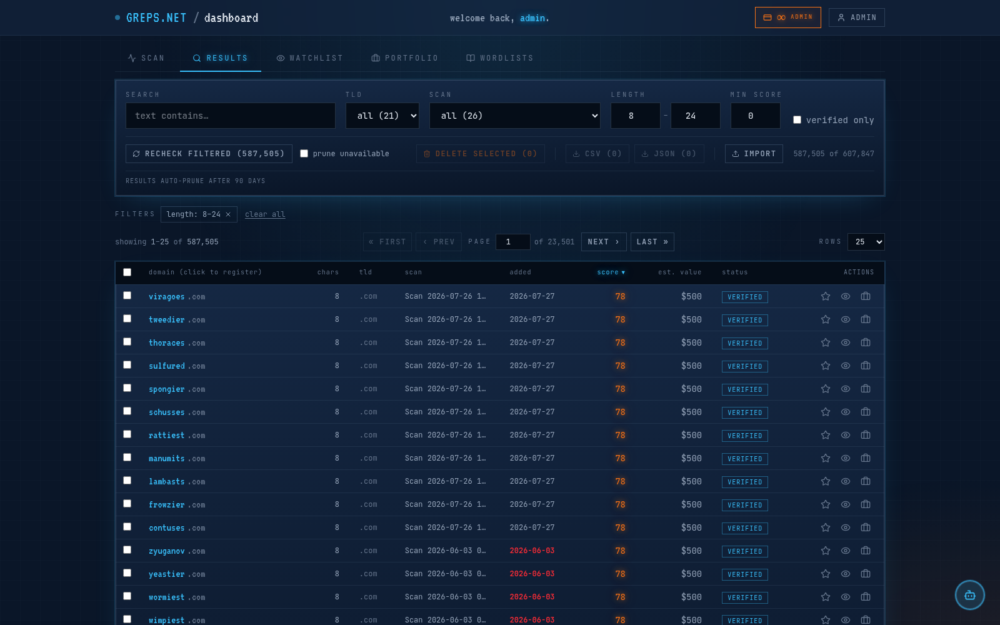

## Wordlists

39 curated system lists to scan against, plus your own uploads.

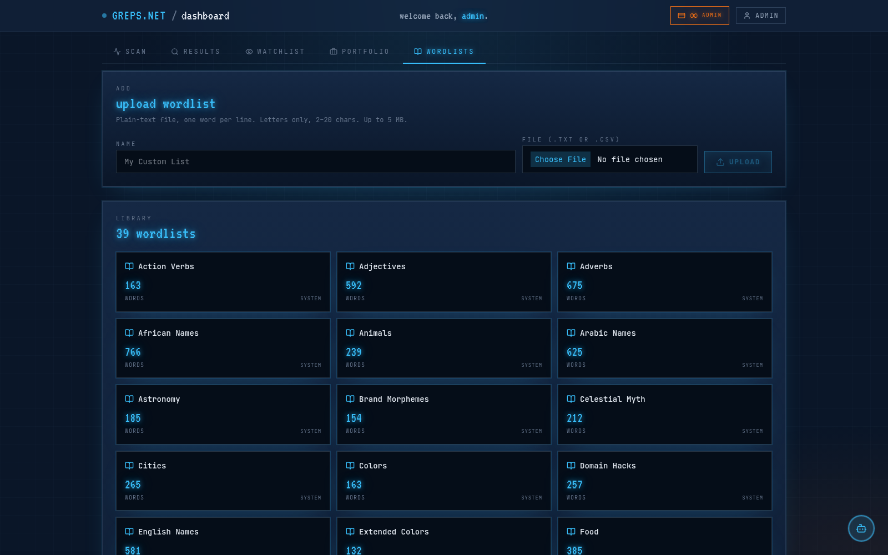

## Engineering highlights

- **RDAP-first correctness** — every verdict comes from the registries' own authoritative
  protocol, not scraped WHOIS, including registry-specific quirks (e.g. some ccTLD
  registries return an ambiguous 404 for both "reserved" and "available" — resolved by
  reading the response body, not just the status code).
- **Concurrency-safe billing** — every credit debit runs through a single row-locked,
  idempotent ledger. A batch of verifications takes the lock once, charges only definitive
  available/registered verdicts, and mathematically cannot take a balance negative or
  double-charge a retried request.
- **Real-time without a queue-per-request** — a client-driven pipeline (browser-side DNS
  pre-check → server-side RDAP verification → polled drain) paced by a token bucket tuned
  to measured verify throughput, so the live terminal streams smoothly whether the scan is
  a hundred candidates or a hundred thousand.
- **Built at real scale** — production inventory in the hundreds of thousands of verified
  domains, checked across dozens of curated wordlists and all 35 supported TLDs.

## Built with

Laravel · Inertia · React · TypeScript · Tailwind CSS · RDAP · MariaDB · Redis

---

© 2026 greps.net · Showcase repository — application source is private.

